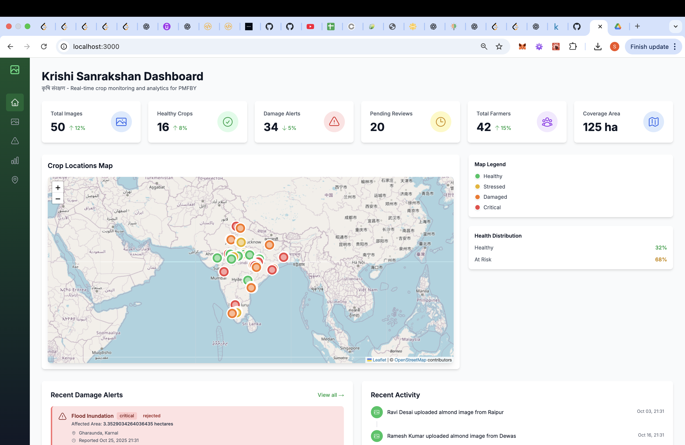
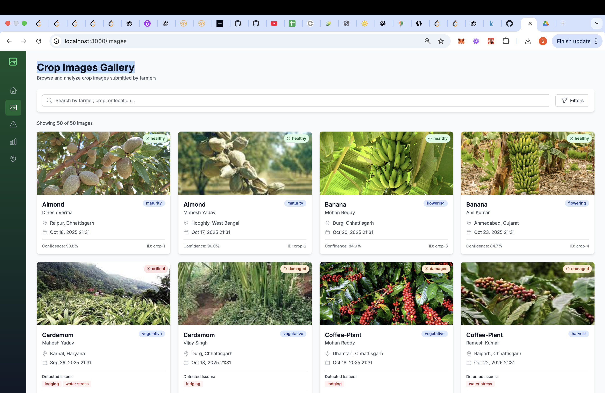
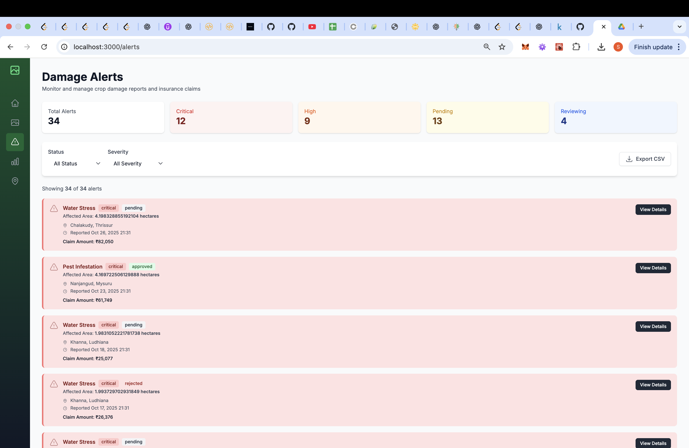
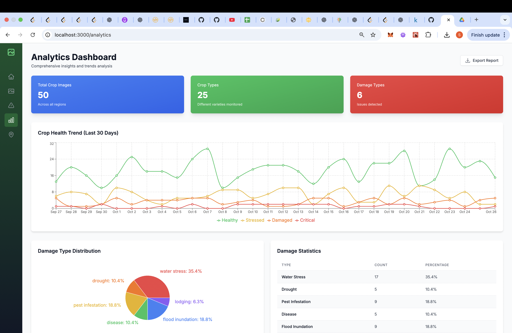

# Krishi Sanrakshan (कृषि संरक्षण)
## Crop Monitoring Dashboard

**Agricultural Protection through Real-Time Monitoring**

A comprehensive web dashboard for real-time crop image analytics under the Pradhan Mantri Fasal Bima Yojana (PMFBY) initiative.

## 🎥 Demo Video

[](https://drive.google.com/drive/folders/1v5UuAlxmHhOUXnuxi3VdFHptqgNmy9aC?usp=drive_link)

> **📹 [Click here to watch the demo video](https://drive.google.com/drive/folders/1v5UuAlxmHhOUXnuxi3VdFHptqgNmy9aC?usp=drive_link)**

## 📸 Screenshots

### Main Dashboard

*Real-time statistics, interactive map, and recent activity feed*

### Crop Images Gallery

*Browse and filter crop images with AI analysis results*

### Damage Alerts

*Monitor and manage crop damage reports with severity indicators*

### Analytics Dashboard

*Comprehensive insights with charts and regional statistics*

## 🌾 Overview

Krishi Sanrakshan (Agricultural Protection) is a digital platform that leverages mobile photography and artificial intelligence for timely, accurate crop condition assessment. This dashboard provides real-time monitoring and analytics for crop insurance claim processing.

## ✨ Features

### 1. **Main Dashboard**
- Real-time statistics (Total Images, Healthy Crops, Damage Alerts, etc.)
- Interactive map showing geo-located crop images
- Recent activity feed
- Quick overview of crop health distribution

### 2. **Crop Images Gallery**
- Browse all submitted crop images
- Advanced filtering (Crop Type, Growth Stage, Health Status, State)
- Search functionality
- Detailed AI analysis results for each image

### 3. **Damage Alerts**
- Comprehensive damage report management
- Filter by status and severity
- Export to CSV functionality
- Quick view of critical alerts

### 4. **Analytics Dashboard**
- 30-day crop health trends
- Damage type distribution charts
- Regional statistics comparison
- Crop type distribution analysis
- State-wise breakdown tables

### 5. **Regional Overview**
- Geographic map of all monitoring locations
- State-wise filtering
- Coverage statistics

## 🛠️ Tech Stack

- **Framework**: Next.js 14 (React)
- **Language**: TypeScript
- **Styling**: Tailwind CSS
- **UI Components**: Headless UI
- **Icons**: Heroicons
- **Maps**: Leaflet & React-Leaflet
- **Charts**: Recharts
- **Date Handling**: date-fns

## 📦 Installation

1. **Install dependencies**:
```bash
npm install
```

2. **Run the development server**:
```bash
npm run dev
```

3. **Open your browser** and navigate to:
```
http://localhost:3000
```

## 📁 Project Structure

```
krishi-sanrakshan-dashboard/
├── app/                          # Next.js app directory
│   ├── page.tsx                 # Main Dashboard
│   ├── images/page.tsx          # Crop Images Gallery
│   ├── alerts/page.tsx          # Damage Alerts
│   ├── analytics/page.tsx       # Analytics Dashboard
│   ├── regions/page.tsx         # Regional Overview
│   ├── layout.tsx               # Root layout
│   └── globals.css              # Global styles
├── components/
│   ├── layout/
│   │   └── KrishiSanrakshanLayout.tsx
│   ├── cards/
│   │   ├── StatsCard.tsx
│   │   ├── CropImageCard.tsx
│   │   └── AlertCard.tsx
│   ├── maps/
│   │   ├── CropMap.tsx
│   │   └── MapLegend.tsx
│   └── charts/
│       ├── CropHealthChart.tsx
│       ├── DamageDistributionChart.tsx
│       ├── RegionalStatsChart.tsx
│       └── CropTypeDistributionChart.tsx
├── lib/
│   ├── types.ts                 # TypeScript interfaces
│   ├── api.ts                   # API client
│   ├── mockData.ts              # Mock data generator
│   └── cropImages.ts            # Crop image mappings
├── Agricultural-crops/          # Dataset images (30 crop types)
└── public/                      # Static assets
```

## 🌱 Crop Dataset

The dashboard uses images from the `Agricultural-crops` dataset containing 30+ crop varieties:
- Almond, Banana, Cardamom, Cherry, Chilli, Clove, Coconut, Coffee
- Cotton, Cucumber, Fox-nut, Gram, Jowar, Jute, Lemon, Maize
- Mustard-oil, Olive, Papaya, Pearl-millet, Pineapple, Rice
- Soyabean, Sugarcane, Sunflower, Tea, Tobacco, Tomato, Mung, Wheat

Each crop type has multiple images used for training ML models and displaying in the dashboard.

## 🔧 Configuration

### Environment Variables
Create a `.env.local` file:
```env
NEXT_PUBLIC_API_URL=http://localhost:8000
```

### Mock Data
Currently using static mock data. To connect to a real FastAPI backend:
1. Update `NEXT_PUBLIC_API_URL` in environment variables
2. Uncomment API calls in `lib/api.ts`
3. Ensure backend endpoints match the API client methods

## 📊 Data Structure

### Crop Image
- Farmer details
- Crop type and growth stage
- Geographic location (State, District, Village)
- AI analysis results (Health status, Confidence score, Detected issues)
- Timestamps

### Damage Alert
- Severity level (Low, Medium, High, Critical)
- Damage type (Flood, Pest, Disease, Drought, etc.)
- Affected area (hectares)
- Claim amount
- Status (Pending, Reviewing, Approved, Rejected)

## 🚀 Future Enhancements

- [ ] FastAPI backend integration
- [ ] MySQL database connection
- [ ] Real-time WebSocket updates
- [ ] User authentication and roles
- [ ] Advanced ML model integration
- [ ] Weather data correlation
- [ ] Mobile app integration
- [ ] PDF report generation
- [ ] Multi-language support

## 📝 Scripts

```bash
# Development
npm run dev

# Build for production
npm run build

# Start production server
npm start

# Lint code
npm run lint
```

## 🎨 Design Features

- **Responsive Design**: Works on desktop, tablet, and mobile
- **Modern UI**: Clean, professional interface with Tailwind CSS
- **Interactive Maps**: Leaflet integration with custom markers
- **Rich Charts**: Multiple chart types for data visualization
- **Color-coded Health Status**: 
  - 🟢 Green: Healthy
  - 🟡 Yellow: Stressed
  - 🟠 Orange: Damaged
  - 🔴 Red: Critical

## 📄 License

This project is developed for the Pradhan Mantri Fasal Bima Yojana (PMFBY) initiative under the Ministry of Agriculture and Farmers Welfare.

## 👥 Contributing

This is a government initiative project. For contributions or queries, please contact the project administrators.

---

**Built with ❤️ for Indian Farmers**

